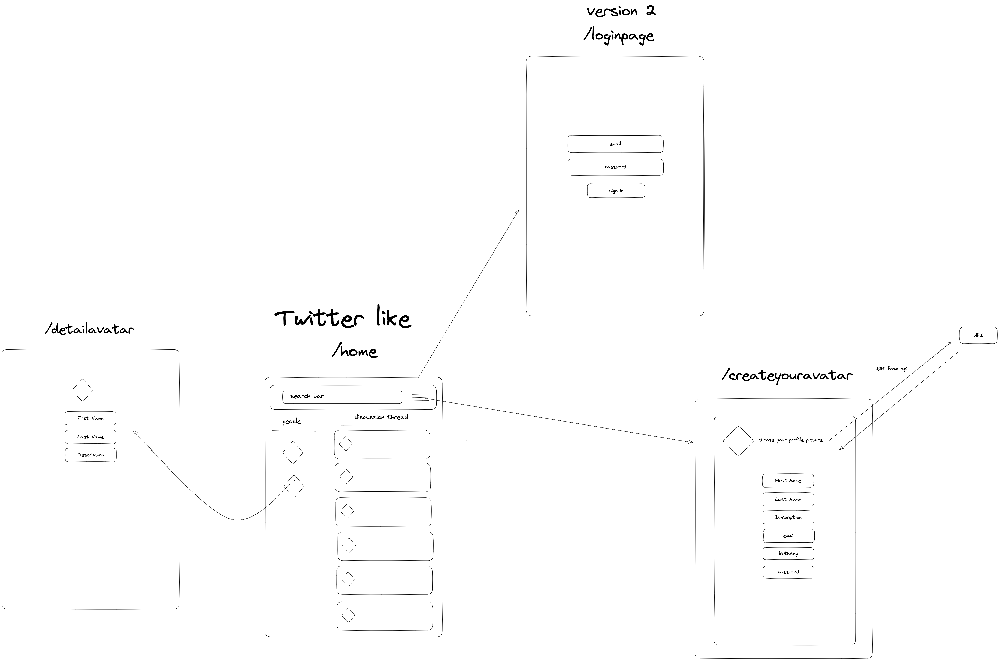

#################

# Project #2 ironhack-twitter-project

################

# Introduction - Initial plan

development of a web application (twitter like) using react.js

- Iteration 1
  home page, creator page, description page
  build the navigation :
  router skeleton in html of home page
  - lync to avatar detail --> creator page
  - lync to create your avatar page
- Iteration 2
- Iteration 3
- Iteration 4

# MVP

Our MVP should looks like this

# Iteration-1

## 05/10/23

installation of the environment for the twitter like project

- npm install --> installation of npm
- npm i axios --> installation of axios
- npm i react-router-dom --> installation of react-router-dom

## Toheeb's Contribution

-> T-v1:

- Created "AvatarCreator page and DescriptionPage
- Imported {useState} and created a variable holding the link to the dicebear API (https://www.dicebear.com/how-to-use/http-api)
- Created 3 states "name, last name, description" to update what the user inputs into each field.
- Set up "FORM" structure in HTML with each of input section for the user -> Name, Last Name and Description.
- Finally I've partially created a "handleSubmit" function with the purpose of sending the information the user inputs.

## Tonio's Contribution

# Description of the components

- HomePage --> on this page we display on the left all the avatar, and on the right there is a message box to tweet
- DisplayAvatar --> from the endpoint https://ironrest.fly.dev/api/avatar-collection" this is component gonna display the all avatar and allow to use a searchbar to filter
- loginPage --> on this part we first call the an endpoitn to get all information from the users and compare with the email and the password of the user (bad practices in fact whe should handle it from the backend) we then store \_id int the local storage and close the page to return to the Homepage
  -Tweeting --> we call two endpoint of the api, to merge the data from the avatar before tweeting
- AvatarCreator
- DescriptionPage

# Technical challenges

manage the login feature without a backend to manage the credential of the users
We find a way using local storage to manage it

# Big mistake

# Demo

https://iron-twitter.netlify.app/

# Feature slide

# Future Improvements

# Conclusion
